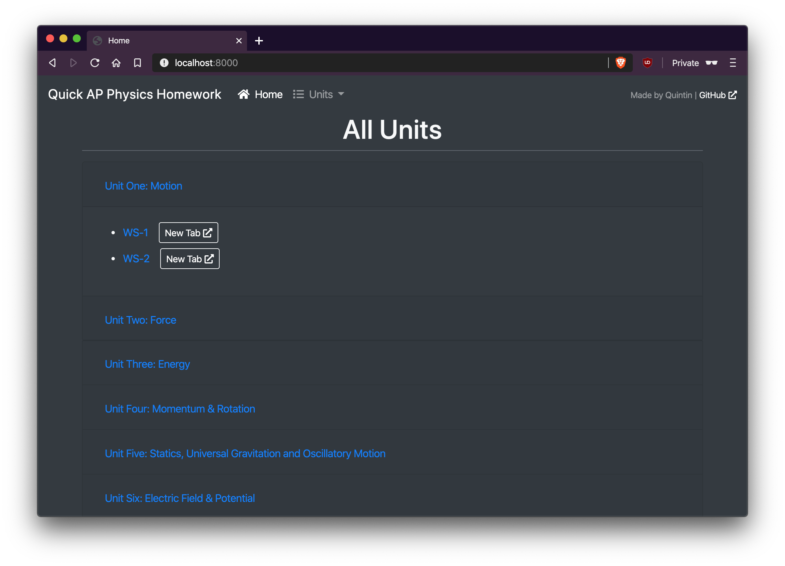
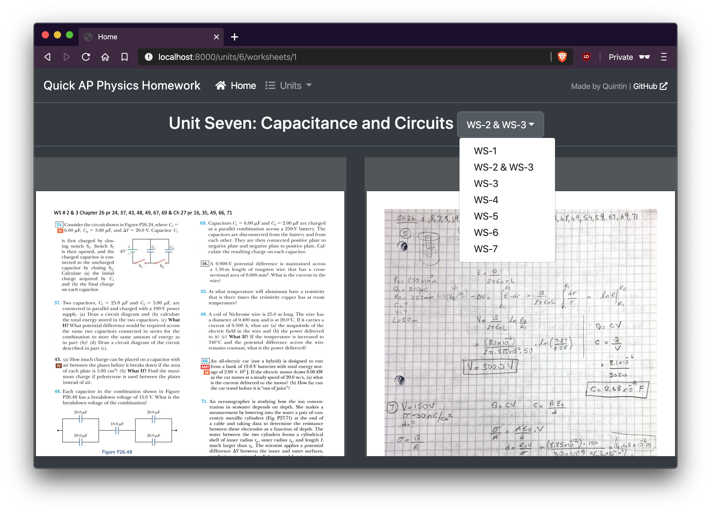

# Quick Physics Homework

## Language?
Go! One of my favorites.

## Framework?
[Mux](github.com/gorilla/mux) only. Go has a nice standard library I must say

## Deployment?

Heroku

## Interface (HTML & CSS)?

Bootstrap for structure/looks. Fontawesome for icons.

## Screenshot?

Ok

